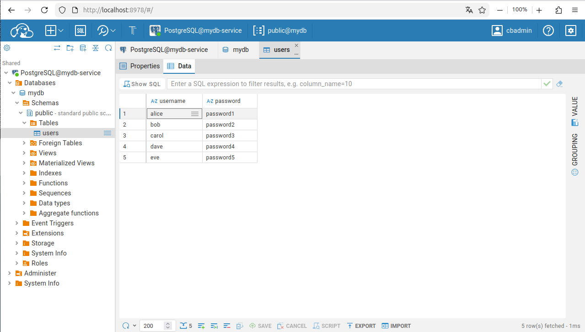

# Ejercicio 3

Almacenamiento persistente en K8s.

### Guía

En este ejercicio vamos a utilizar un PVC para persistir la información 
de una base de datos Postgres. Durante el ejercicio, vamos a 
desplegar una base de datos SQL y, usando un editor SQL, vamos a
cambiar uno de los registros de la BD. Luego, borraremos el
deployment de Postgres y lo volveremos a arrancar. Como usaremos un
PVC, observaremos que tras volver a arrancar la base de datos,
el cambio que hemos hecho se mantiene.

Lo primero que hay que hacer es descargarse los tres ficheros que se 
encuentran en esta carpeta del repositorio:

- **`postgres.yaml`**, que desplegará una base de datos Postgres con información
sobre usuarios de una aplicación.
- **`cloudbeaver.yaml`**, que desplegará una editor SQL al que podremos acceder desde
nuestro navegador, para ver los datos que hay en la BD.
- **`postgrespvc.yaml`**, que define un PVC en el que se
guardará la información de la BD.

Una vez descargados los ficheros, los aplicamos con el comando `kubectl apply`:

```
kubectl apply -f postgrespvc.yaml
kubectl apply -f postgres.yaml
kubectl apply -f cloudbeaver.yaml
```

A continuación, creamos un tunel con el siguiente comando (por
comodidad, ejecutarlo en una terminal distinta):

    kubectl port-forward deployment/cloudbeaver 8978:8978

y accedemos a CloudBeaver desde `localhost:8978`.

Una vez accedido a CloudBeaver, damos de alta el usuario
administrador:

- Usuario: `cbadmin`
- Contraseña: `Password123`

Una vez dado de alta el usuario administrador e iniciado sesión,
hay que conectarnos a la basde de datos que hemos despelgado.
Para ello:

1. Hacer clic en el icono que aparece en la esquina superior
derecha (logo de CloudBeaver).
2. Clic en "New Connection".
3. Escoger el driver de PostgreSQL.
4. Rellenar los siguientes campos:
    - **Host**: mydb-service
    - **Database**: mydb
    - **User name**: usuario
    - **User password**: password

Una vez rellenados los campos, clicar el botón "Create". Esto
nos añadirá a la izquierda un menú desplegable con la nueva 
conexión. Al clicar este menú, introducir los credenciales
que acabáis de poner.

Podemos acceder a los datos de los usuarios usando este menú, tal
como aparece en la siguiente imagen:



Ahora, vamos a cambiar un registro de la base de dato. Para ello, 
seleccionamos la celda que queremos cambiar, realizamos los 
cambios que queramos, y clicamos el botón "Save" de abajo.

Tras haber realizado el cambio en el registro, procedemos a borrar el deployment y 
arrancarlo de nuevo:

```
kubectl delete -f postgres.yaml
kubectl apply -f postgres.yaml
```

Si seguido el ejercicio correctamente, el cambio que se haya realizado debería mantenerse.


